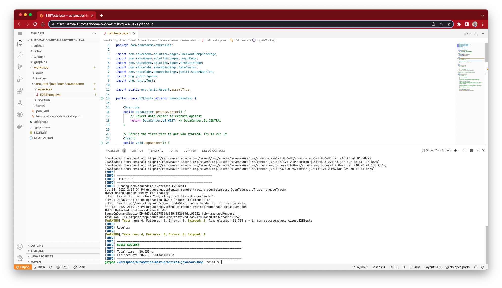

<div id="header" align="center">


<div id="badges">
<!-- badges: start -->

[](https://github.com/c3ccl3ston/automation-best-practices-java/actions/workflows/e2e_test_examples.yaml)
[](https://github.com/c3ccl3ston/automation-best-practices-java/actions/workflows/e2e_test_solutions.yaml)

<!-- badges: end -->
</div>
</div>

## Testing for Good

[](https://twitter.com/hashtag/Testing4Good)

### 🌎 Testing for Good enables great test automation engineering while shaping a more equitable society. 👩‍💻

Today, we're asking for donations for [Environmental Working Group](https://buy.stripe.com/9AQdU42lj9i7bHGcMN)

### [About Environmental Working Group](https://www.ewg.org/)

We're advocates who won't quit. We're scientists that find solutions. We're people trying to make the safest choices for our health. At the Environmental Working Group, we believe that you should have easy access to the information you need to make smart, healthy choices. It’s this belief that inspired our president and co-founder, Ken Cook, to create EWG.

Since 1993, we've worked tirelessly to protect public health. Whether it's spotlighting harmful industry standards, speaking out against outdated government legislation or empowering consumers with breakthrough education and research, we're in this fight.

And we're not going anywhere.

👉 While the event is free, Sauce Labs encourages all attendees to

👉 **[donate](https://buy.stripe.com/9AQdU42lj9i7bHGcMN)**

Anything helps!

100% of donations go to support the cause

## You will learn:

In this automation best practices workshop you will learn the latest and greatest tools and techniques to drastically 
improve your testing!

We will focus on a holistic approach of risk mitigation by doing:

- Functional web testing
  - Create a framework for doing comprehensive web testing
  - Use industry-standard best practices
  - Create functional browser tests using Selenium
- Many other things in between
  - Accessibility testing
  - Run in massive parallel (100s of tests in < 5 min)
  - Automatically get robust test reports which includes logs + videos

## Technologies you will use:

[![Java](https://img.shields.io/badge/Java-3A75B0?style=for-the-badge&logoColor=white&logo=data%3Aimage%2Fpng%3Bbase64%2CiVBORw0KGgoAAAANSUhEUgAAACYAAAAwCAYAAAB9sggoAAAAAXNSR0IArs4c6QAAAIRlWElmTU0AKgAAAAgABQESAAMAAAABAAEAAAEaAAUAAAABAAAASgEbAAUAAAABAAAAUgEoAAMAAAABAAIAAIdpAAQAAAABAAAAWgAAAAAAAABIAAAAAQAAAEgAAAABAAOgAQADAAAAAQABAACgAgAEAAAAAQAAACagAwAEAAAAAQAAADAAAAAAmGgvegAAAAlwSFlzAAALEwAACxMBAJqcGAAAAVlpVFh0WE1MOmNvbS5hZG9iZS54bXAAAAAAADx4OnhtcG1ldGEgeG1sbnM6eD0iYWRvYmU6bnM6bWV0YS8iIHg6eG1wdGs9IlhNUCBDb3JlIDYuMC4wIj4KICAgPHJkZjpSREYgeG1sbnM6cmRmPSJodHRwOi8vd3d3LnczLm9yZy8xOTk5LzAyLzIyLXJkZi1zeW50YXgtbnMjIj4KICAgICAgPHJkZjpEZXNjcmlwdGlvbiByZGY6YWJvdXQ9IiIKICAgICAgICAgICAgeG1sbnM6dGlmZj0iaHR0cDovL25zLmFkb2JlLmNvbS90aWZmLzEuMC8iPgogICAgICAgICA8dGlmZjpPcmllbnRhdGlvbj4xPC90aWZmOk9yaWVudGF0aW9uPgogICAgICA8L3JkZjpEZXNjcmlwdGlvbj4KICAgPC9yZGY6UkRGPgo8L3g6eG1wbWV0YT4KGV7hBwAAB9pJREFUWAnFmGmoVVUUgN9znrJybnJqsLQ0zEa1EhItLcTIwtLCH4JKJQ0%2F6kfSYFHQAIFDFpRFBQWVDYQJmdE8qJkZlqamZs5Tzvr6vn33Pp373sXee95owffW3mtP66y9zt7nvoqKMkpVVVUDp0O3gC7QMNaDvS5L1XlAbSavrKzcQ7%2BhcFbsX%2Bd1GtVmobr0IUr4VVnFmCvA%2BZfBkZyd6r9LWRzLLdrMaFFvydJDYKsuYNMxt%2FWw9dpInUNcfdLkFLoJbQdi%2B2R0G%2Fgr1v8fpVPRMRP%2FJjgAyvjkEeXKUuVkK7tmwWZpUbRO7QJlM5zvguim0BhaQouyO1F9wvwilCdDXqZFp4xmsxJjjzmNqs9pBCohe3LKM0A5WFBVq9A98gOpG7EB8AAMh7C1Sef71qvMRA2gqYPRp8ICUPYVVPjrGWa7zoyE6bAB9sOj0NH2sgkT6lQ4YtCXwlpQdhdU%2BDvKBSmNgu9AZxT7Di6bM2kiJtWpkBfooZAW3Ek5yejo1LRkiPpVdH7ry5NfTGpOJacGUk65tINykrHRqVnJEPVDuYdrhC3cn8l2TJrJ0va1o7wsLrgtatXt0akxOZvFqWlhyo1TuSyaCbOwU54ISj6nHo5OGdWPQmvhz8eo4Aw6vCx1cShb9CiDshObPn1jv4NRv4ueEsseD6fHsupL7sjU71DOXqtibRzLT5TuvtYYj8AML%2Bhch%2Ba58nlEKuVTXdepqM2A8MkSF%2Fwsasf9Ab%2FEumotrIl1IzUMBsW6n0HlF548JX9ryl%2BC4hs5wtXQRlB9Nyh%2B%2BihzIeVZeZM%2FLpg%2FLjzDksyO7Wlx78X5sTHdBDfEPp6D%2BXzVfOzCpNm2U74nLr4VHV4IdFtXQfeD%2FFHyclode4h8qtdbM1GIFDo8LTrbDspPgjLDBdD2SXfoVBuifIhOEc2Pz8%2F979FkkjSgZNhpz0duZly8f3SuXdR%2BRWyMbU9oU6int7RgqPaX9pJrOrB0Q2HS5rS3AV%2BA7PuK8mPwDjSE4DR6MCh%2ByZ7j%2BuhmUGN%2BbFkUY7%2FQJ%2BvoICS81pRPoFNv6AX%2BBOsK%2B%2BF7WBA1quKgY5DhlA9QnquR%2Bvuoq%2BFKbPYvEtqPx%2BBXyBg4CdbALPq%2Bjq4pDPCp74AVkBe%2FDk6tOaKmhX5XwVPgw2VCvRX00Q5%2Bx10P5mL%2BQ2CCA7A1CBGjgLPhya%2FFPifO5i8eT%2FXd8Ax8BX66ePrvBX%2BKGWG3z6312tGZTvBn1EZc22mR%2BegHWWsdOghrd6PwMXSBTWranT94mBw8m46LwNO%2B3PJoWKywnp8%2FIWfj%2Bm%2FGxQ6jz9EWzpUYrQbon2m4DPstcAnYqSWYX0ZCjKJRMlpGSWw3kkZ3J2yA32ElrAYvdG1uU2PKXlmHKDtWObGgwtzuVEWIVDQ6qBGDUudgxuYRMBbcxrfBg9TzSgddYB%2FolA7tYPwOdA1hHq%2BtPWl%2B6s0p70Wfif1rcMt%2FhR7YnbtY6Oi1YpR0tD14VvnF%2Blpxz6PX6N8JroFwM8T5Usr4IyUcE%2BgXIcmk2K%2BQ%2FPkl6IHD2bHxAm3jYrsh9rj4HPyS2AZGy6czJYyox0AHMNm7g06ZyNNhGvOuYf60lT74BO2gvEL7GAv6oC6SvJHydZA%2BpSnWWzYx8sb8QtTvjbN52U9NbZTN3%2BIcS415TUcTfgScAl3hYugM4V5E52UPlc2wGhbCb7A8lrcSEX9ZmSZ3gjsxD57D7k4YqSzHi0JmA%2B1F95mTxUG90D71e7AUfGNTf18C30i3NzlwHGN3US8S1vCh%2BsE3tPvmpq3TKef5R%2BjsPVYqAuEpaLsZtoPyCHh6N08zUDaZ%2FQV1LoyAKfA5%2BONkQK5f2KZUV9Puv0XNzyLxuG%2BCp%2BHssIV6K5SR1L4l2jahPTb2gg5p3wg%2BYeiLdpzJr64uj2O4n%2FnCMcAaKdKHsYXjCVtDyoeLBmLsAY%2FDPPCe9Nf1ctB2CtwF6Zc3xVrLSnr65TESQrRKaD8sLypyiIoRM7FfAg%2FAJM9TmAtGZSlPspl%2BvSkPAnPNF8GD1i0wJ1OOGcn1sAJ%2Bgh8ZuwYdhDmMrniGtaJtC7bbKE%2BHi6gvsQ9S5datB8V7SplJp0yo18i%2FaDPPPIA7Qls4DtyiIsHmw4c8QnvZZ0K9C3wKyujUQLmJjn2hFTG5vb82gJ8%2BHhP%2FiTC3Hwv3we%2BgLAXzM7wMap%2FGU9o7MLs6bEDcjkWwGNyWVeBL4F3onVf8amPMC%2FO6XS2hDbj1Z4Dp4Dko6Q2dQ3ki861jjP%2F19sDt6X7rZRPUrTAOLoFS4hu5HXRsJ6TvsuyNxma%2BuV06ZAR0yrc53IvoJObiezAbPsGZ7G3El0nYRhkx7NndqKO9wCe6EPpADzgR6is%2BiC%2FAMlgI38IPrOmLlQl%2B9KXyNFwOQ1PE%2FBYLZ0zWM1dg0AlU3Q633dzTUd9ID2UT3m31hjCqnvbbwKhshk2WmT%2BcV5QzYV7f7GEwHvqD33jD6ftBcIyK22lZDCHVcNB67bQHt2019lXoegtzdmBwT9CJITAQkjxL4SHW8GiqzBxLrerQUHDOnDFKF4D3mwnseWeEzDejshXMuX2Qom5OGWUf6mToAt3AfEtihBfAG%2FCWDtnA2mH3Sjpmh1LCIF%2BS7uBTm4vmX2cwEm6v15XJr2Nui1u7B1zUC3s5LIHF8BPO%2BEBBdIhC2C0NfwNcBnrvYuSigAAAAABJRU5ErkJggg%3D%3D)](https://www.java.com/en/)
[](https://www.selenium.dev/)
[](https://maven.apache.org/index.html)
[](https://www.saucelabs.com)
[](https://github.com/features/actions)

## Table Of Contents

- Introduction to workshop
- Setup
  - [Gitpod setup](#gitpod-setup)
  - [Setting data center](#setting-data-center)
- [E2E browser tests](./workshop/docs/E2E-TESTS.MD)
- [Atomic tests](./workshop/docs/ATOMIC-TESTS.MD)
- [Parallelization](./workshop/docs/PARALLEL.MD)
- [Conclusions](./workshop/docs/CONCLUSIONS.MD)

## Requirements

**This is NOT a beginners course. You will not learn Java testing fundamentals here. However, you will learn a number 
of amazing skills, techniques, and tools to help you test web applications**

- At least 1 year of Java programming
- Deep understanding of Selenium WebDriver
- Deep understanding of OOP
- Java 8 installed
- Java IDE installed
- [Git](https://git-scm.com/downloads)
- [Maven installed](https://maven.apache.org/install.html)
- Free [Sauce account](https://www.saucelabs.com/sign-up)

## Team

### Your Instructor: Chris Eccleston


#### Facts about me:

- 🏢 Solution Architect at Sauce Labs
- 😄 Pronouns: he/him
- 🏠 Home automation enthusiast

[](https://www.linkedin.com/in/chris-eccleston-42119541/)
[](https://twitter.com/chriseccleston)
[](https://www.github.com/c3ccl3ston)

### Your TA: James Tacker


#### Facts about James:

- 🏢 DevOps Engineer at Sauce Labs

[//]: # (- 📫 Links:)
[//]: # ([![LinkedIn]&#40;https://img.shields.io/badge/LinkedIn-0077B5?style=for-the-badge&logo=linkedin&logoColor=white&#41;]&#40;https://www.linkedin.com/in/chris-eccleston-42119541/&#41;)
[//]: # ([![Twitter]&#40;https://img.shields.io/badge/Twitter-1DA1F2?style=for-the-badge&logo=twitter&logoColor=white&#41;]&#40;https://twitter.com/chriseccleston&#41;)
[//]: # ([![Github]&#40;https://img.shields.io/badge/Github-100000?style=for-the-badge&logo=github&logoColor=white&#41;]&#40;https://www.github.com/c3ccl3ston&#41;)

## Setup

### Sign up for account
[](https://saucelabs.com/sign-up)

### Get your username and api key
> Sauce Labs Username and Access Key can be found here: [Sauce Labs user settings page](https://app.saucelabs.com/user-settings)

### Gitpod setup

[](https://gitpod.io#https://github.com/c3ccl3ston/automation-best-practices-java)

> ℹ️ Gitpod lets you run an entire Dev environment from a browser! You can use this approach if you don't 
> know how to set up a local Java environment.

1. Once the Gitpod.io URL is loaded, you will need to sign in with the GitHub account you created earlier
2. Once the development environment is loaded, you should see 'Ready to test!' in the Terminal window in the lower 
portion of the window, run the following commands in that Terminal to set your `SAUCE_USERNAME` and `SAUCE_ACCESS_KEY`:


> ℹ️ You can get your Sauce Labs Username and Access Key by going to the [Sauce Labs user settings page](https://app.saucelabs.com/user-settings)

```bash
eval $(gp env -e SAUCE_USERNAME=<sauce_username>)
eval $(gp env -e SAUCE_ACCESS_KEY=<sauce_access_key>)
```

> Replace <sauce_username> and <sauce_access_key> with your credentials

Once you have run those 2 commands, you can run the following commands to test your environment variables:

```bash
echo $SAUCE_USERNAME
echo $SAUCE_ACCESS_KEY
```

Run sanity tests

```bash
mvn test -Dtest=E2ETests -X
```


### ✅ 👏 Environment setup is complete if 1 test passed & 3 tests were skipped

## Setting data center

By default, the data center selected for our exercises is `US_WEST`. If you would like to switch to another data 
center (i.e. `EU_CENTRAL`), please update the [E2ETests](workshop/src/test/java/com/saucedemo/exercises/E2ETests.java) with the appropriate data center.

## Stay to the end and win a prize!

Stay to the end and 2 lucky people can win a snazzy Backpack!


## Key

💡 this is a tip

🏋️‍ this is an exercise for you to do

❓ this is a question for us to think and talk about. Try not to scroll beyond this question before we discuss

## Let's get started! [➡️](workshop/docs/E2E-TESTS.MD)